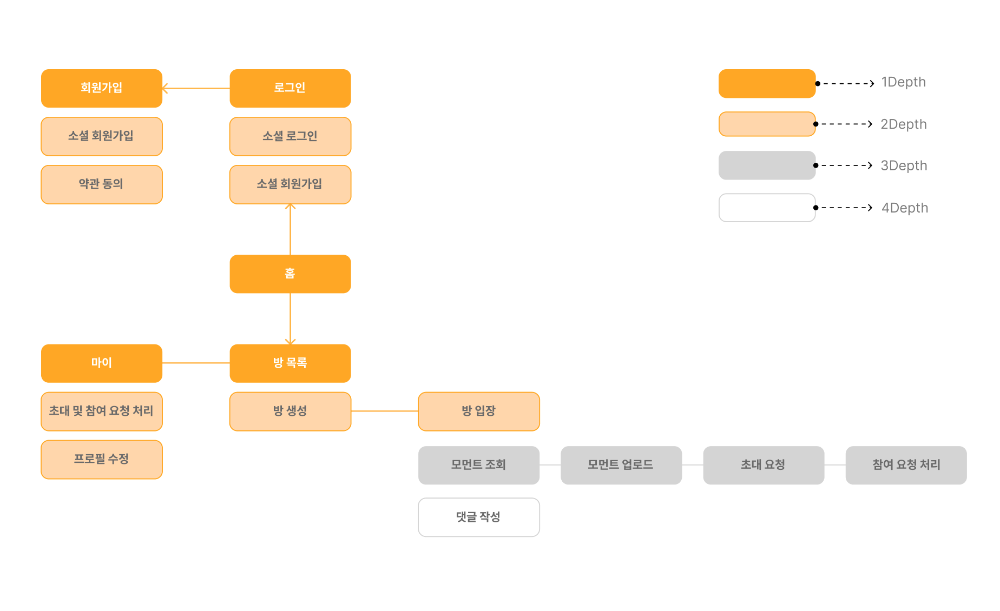
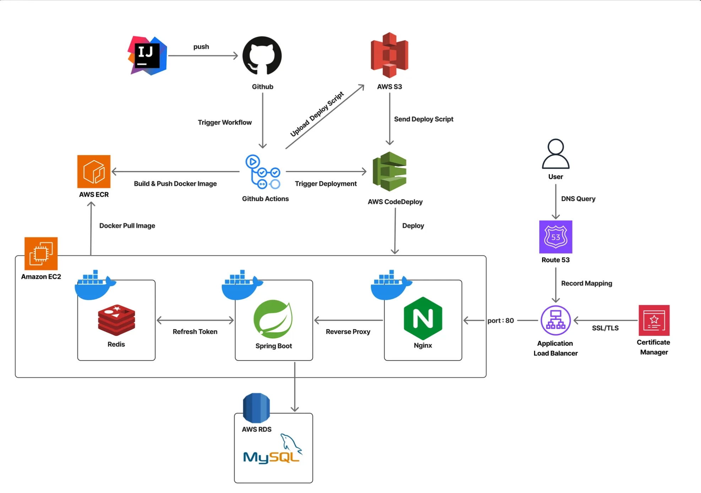
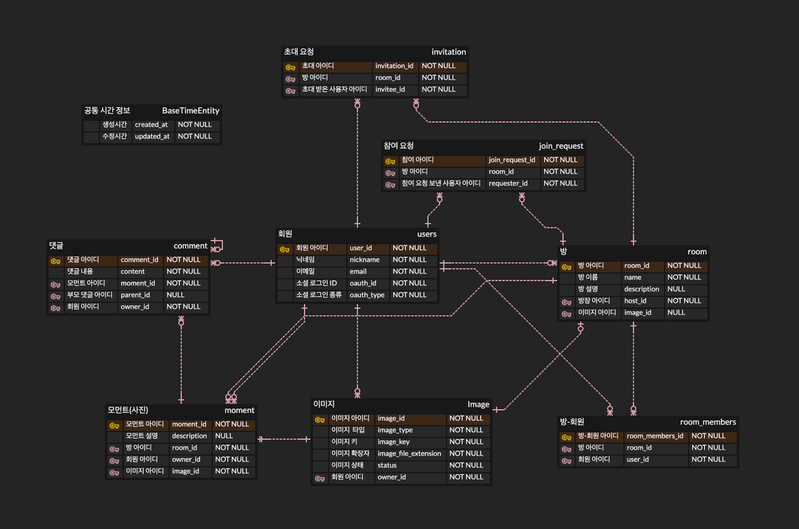

<div align=center>

## 우리만의 공간, 특별한 추억 OurHood 📸

<b> 우리만의 방에서만 소통하며, 안전하고 따뜻한 공간을 경험해보세요 <br/>
OurHood는 가족, 친구, 팀, 동아리 등 개인적인 조직 단위로 추억과 사진을 공유할 수 있는 커뮤니티 서비스입니다 </b>

</div>

<br>

---

### ✨IA(Information Architecture)



<br>

---

### 📁 Application Architecture

- Domain-Driven Design (DDD) 기반으로 설계되었습니다.

```bash
📁server/
   └── ourhood/
       ├── domain/ # 주요 도메인
       │   ├── auth/ # 인증 관련 기능 모듈 (OAuth, JWT 등)
       │   ├── comment/ # 댓글
       │   ├── common/ # 공통
       │   ├── image/ # 이미지
       │   ├── invitation/ # 초대 요청
       │   ├── join/ # 참여 요청
       │   ├── moment/ # 모먼트(사진)
       │   ├── room/ # 방
       │   └── user/ # 회원
       └──  global/ # 애플리케이션 전반에 걸쳐 사용되는 공통 기능
            ├── annotation/ # DateFormat 어노테이션
            ├── auth/ # 인증 필터 및 어노테이션
            ├── config/ # 애플리케이션 설정 (Cloud, Converter, JPA, QueryDsl, Redis, S3, Security, Swagger, Web)
            ├── exception/ # 예외 처리
            ├── redis/ # Redis 서비스
            ├── util/ # Util (CloudFront, Cookie, S3, UUIDGenerator)
            └── response/ # 공통 응답 형식
```

<br>

---

### 🏛 System Architecture



<br>

---

### 🛠 Tech Stack

| 구분             | 기술 스택                                                                                                                                                                                                                                                                                                                                                                                                                                                                                                                                            |
|----------------|--------------------------------------------------------------------------------------------------------------------------------------------------------------------------------------------------------------------------------------------------------------------------------------------------------------------------------------------------------------------------------------------------------------------------------------------------------------------------------------------------------------------------------------------------|
| Framework      |                                                                                                                                                                                                                                                                                                                          |
| ORM            |                                                                                                                                                                                                                                                                                                                                                                                                                              |
| Authorization  |                                                                                                                                                                                                                                                                                                             |
| Database       |                                                                                                                                                                                                                                                                                                                                  |
| CI/CD & DevOps |                                                                                                                                                                                                                                                                                                     |
| Infrastructure |      |

<br>

---

### 📈 DataBase Schema

### MySQL Schema



<br>

---

[//]: # ()

[//]: # (## 🔥OurHood 핵심 기능)

[//]: # ()

[//]: # ([//]: # "업데이트 예정")

[//]: # ()

[//]: # (<br>)

[//]: # ()

[//]: # (---)

### 👥 Contributors

| FE                                                                                                                    |
|-----------------------------------------------------------------------------------------------------------------------|
| <a href="https://github.com/dongha-choi"></a> |
| [최동하](https://github.com/dongha-choi)                                                                                 |

| BE                                                                                                             |
|----------------------------------------------------------------------------------------------------------------|
| <a href="https://github.com/so1eeee"> </a> |
| [정 솔](https://github.com/so1eeee)                                                                              |
| 